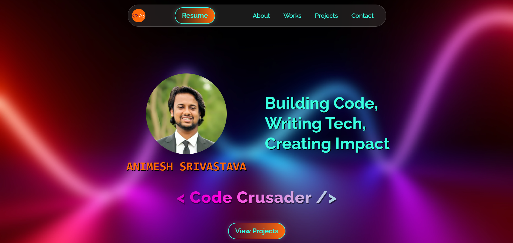

# 🚀 Developer Portfolio

A modern, interactive, and visually engaging **developer portfolio** built with **Svelte** and **Astro**. This project showcases work experience, projects, and skills with smooth animations and a responsive design.

## ✨ Features

- **Dynamic Animations** – Smooth transitions, tilt effects, and interactive elements.
- **Optimized Performance** – Lightning-fast rendering with Svelte.
- **Interactive Experience** – Engaging UI with hover effects and smooth scrolling.
- **Responsive Design** – Works seamlessly on desktops, tablets, and mobile devices.
- **Customizable Theme** – Easily tweak colors, fonts, and styles.
- **Modern Tech Stack** – Uses Svelte, TypeScript, and TailwindCSS for efficiency and scalability.
- **Dark Mode Support** – Looks stunning in both light and dark themes. 🌙

## 📂 Folder Structure

```
📁 src/
├── 📂 components/       # Reusable UI components (Navbar, Footer, etc.)
├── 📂 data/             # JSON data for projects and experience
├── 📂 sections/         # Main sections (WorkExperience, Projects, Contact, etc.)
├── 📂 utils/            # Utility functions (e.g., tilt effect)
└── 📜 pages/index.astro # Main app structure
```

## 🛠️ Tech Stack

- **Frontend:** Svelte, TypeScript, TailwindCSS
- **Animations:** Svelte Transitions, Custom Tilt Effects
- **Data Handling:** JSON for easy content updates
- **Deployment:** Vercel / Netlify / Your preferred hosting

## 🎨 UI Highlights

- **Work Experience Timeline** 🏆

  - Elegant **timeline view** showcasing work experience.
  - **Glowing indicators** for each experience entry.
  - Smooth **fade-in effects** on scroll.

- **Projects Showcase** 💻

  - Animated project cards with **hover scaling effects**.
  - Direct links to **GitHub repositories** and **Live Demo**.
  - Stylish gradient background with **glassmorphism effects**.

- **Navigation & Interactivity** 🧭
  - **Smooth scrolling** to sections for seamless UX.
  - **Dynamic background banners** for each section.
  - Optimized for both **light and dark themes**.

## 🚀 Getting Started

### 1️⃣ Clone the Repository

```sh
 git clone https://github.com/animeshsrivastava246/portfolio-website.git
 cd portfolio-website
```

### 2️⃣ Install Dependencies

```sh
pnpm install  # or npm install / yarn install
```

### 3️⃣ Run the Development Server

```sh
pnpm dev  # or npm run dev / yarn dev
```

> **Note:** Ensure you have `pnpm`, `npm`, or `yarn` installed before running the commands.

Visit http://localhost:4321 to see your portfolio in action! 🎉

## 🔧 Customization

### Modify Work Experience

Your work experience data is stored in `src/data/data.json`. Update the `experience` array to reflect your own experience:

```json
"experience": [
  {
    "title": "Frontend Developer",
    "company": "AwesomeTech Inc.",
    "duration": "Jan 2022 - Present",
    "description": "Developing interactive UI components and improving website performance."
  }
]
```

### Add Your Projects

Similarly, update the `projects` array in `src/data/data.json`:

```json
"projects": [
  {
    "title": "AI Chatbot",
    "description": "A smart chatbot powered by OpenAI's GPT-4 API.",
    "github": "https://github.com/your-username/ai-chatbot",
    "live": "https://ai-chatbot-demo.vercel.app"
  }
]
```

### Change Portfolio Styling

Tweak the styling in `src/styles/global.css` and component-specific styles to match your branding! 🎨

### Edit Background Images

Modify the background images for different sections in `src/assets/backdrops/`.

## 🚀 Deployment

### 🔥 Deploy on Vercel (Recommended)

```sh
npm install -g vercel
vercel
```

Follow the instructions to deploy your portfolio live! 🌍

### 💡 Other Deployment Options

You can also deploy to Netlify, GitHub Pages, or any other static hosting provider of your choice!

## 📌 Future Enhancements

✅ Scroll-based Animations 🚀  

## 📬 Contact

Have feedback or suggestions? Reach out!

📧 Email: [animeshsrivastava246246@gmail.com](mailto:animeshsrivastava246246@gmail.com)  
🔗 Portfolio: [portfolio-animesh-dev.vercel.app](portfolio-animesh-dev.vercel.app)
🐦 X: [@Animesh236](https://x.com/Animesh246)
🧑‍💼 LinkedIn: [@Animesh246](https://linkedin.com/in/animesh246)

---

⚡ **Built with passion using Svelte!** 🔥
